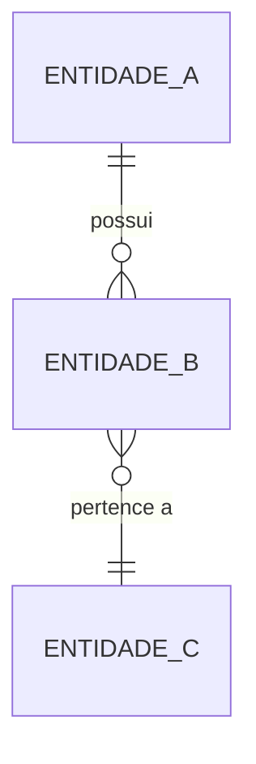

# Modelo de Dados: [Nome do Projeto]

**Tier:** [ver "Calibrando pelo estágio" no SKILL.md]
**ADR(s) relacionado(s):** ADR-XXX
**Requisito(s) de origem:** REQ-XXX

## Diagrama de relacionamento (visão geral)



Substitua pelas entidades reais. Para modelos grandes (dezenas de entidades), o diagrama vira ilegível — nesse caso, use-o só para o núcleo do domínio (5-10 entidades centrais) e deixe o restante só nas tabelas abaixo.

## Entidades principais

| Entidade | Descrição | REQ de origem | Campos-chave |
|---|---|---|---|
| `entidade_a` | | REQ-XXX | id · campo1 · campo2 |

## Detalhamento de campos por entidade

### `entidade_a`

| Campo | Tipo | Nullable | Descrição/Regra |
|---|---|---|---|
| `id` | UUID (PK) | Não | |
| | | | |

> Repita esta subseção para cada entidade que tiver campos não-óbvios o suficiente para merecer explicação — não documente campos autoexplicativos (`created_at`, `updated_at`) com o mesmo nível de detalhe que campos com regra de negócio embutida.

## Relacionamentos N:N e tabelas de associação

Para toda relação muitos-para-muitos, documente a tabela de associação como uma entidade própria — ela quase sempre carrega atributos próprios (papel, status, datas) que não pertencem a nenhuma das duas entidades relacionadas:

```
tabela_associacao
├── id                UUID (PK)
├── entidade_a_id     UUID (FK → entidade_a.id)
├── entidade_b_id     UUID (FK → entidade_b.id)
├── role              ENUM: ...
├── status            ENUM: ...
└── created_at        TIMESTAMPTZ
```

## Decisões de modelagem que vale registrar

Sempre que um modelo de dados for revisado por um motivo estrutural (não apenas adicionar um campo, mas mudar como entidades se relacionam), registre isso tanto aqui quanto em um ADR — a nota abaixo é o formato de callout recomendado para o contexto ficar visível direto no modelo, sem obrigar quem lê a abrir o ADR à parte:

> ✅ **Correção de arquitetura (ADR-XXX):** [o que mudou, por que o modelo anterior não sustentava um cenário real, e o que substituiu]. Ver ADR-XXX para o raciocínio completo.

## Antipadrões a evitar neste documento

- Campo com nome ambíguo sem explicação (`status` sem enumerar os valores possíveis)
- Relação N:N modelada como array/JSON em vez de tabela de associação própria — funciona até precisar de uma query que filtre pelo lado "many", e aí vira migração dolorosa
- Regra de negócio (ex: "nunca cruza `owner_user_id`") mencionada em prosa solta em vez de anotada diretamente ao lado do campo que a implementa

## Rastreabilidade

**REQ de origem:** REQ-XXX
**ADR(s) relacionado(s):** ADR-XXX

> Lembre-se de registrar este documento no `indice-mestre-rastreabilidade.md` se tratado como `DOC-XXX`.
