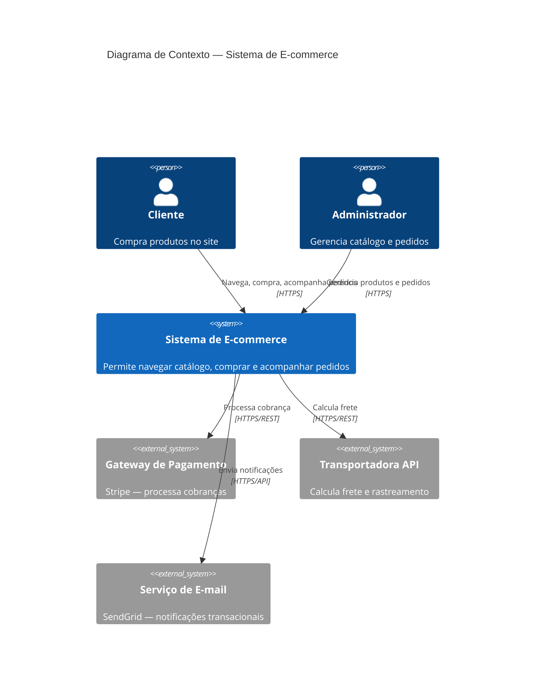
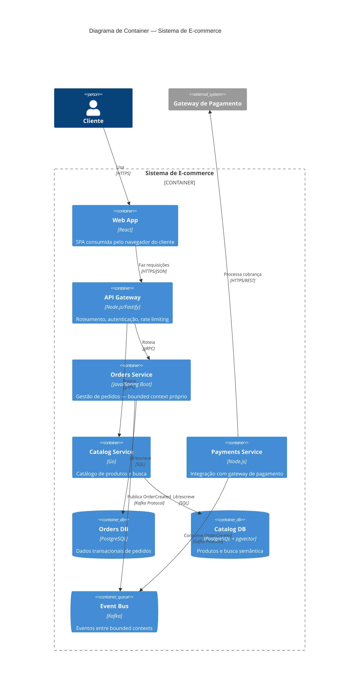
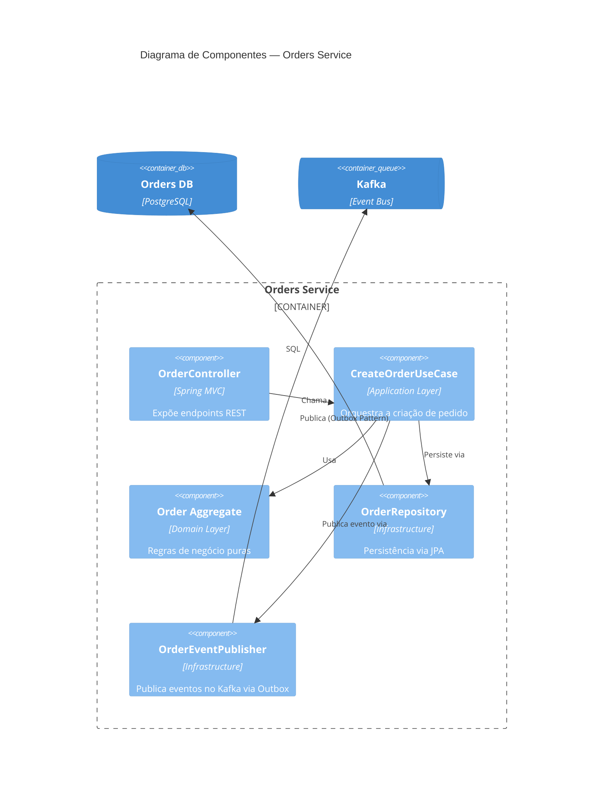

# Padrões de Arquitetura — Microsserviços, DDD, CQRS, Clean Architecture

## Sumário
1. [Clean Architecture](#clean-arch)
2. [Domain-Driven Design (DDD)](#ddd)
3. [Modular Monolith — estrutura e enforcement](#modular-monolith)
4. [Microsserviços](#microservices)
5. [CQRS e Event Sourcing](#cqrs)
6. [Mensageria e Filas](#messaging)
7. [Padrões de resiliência](#resilience)
8. [Diagramação C4 Model com Mermaid.js](#c4-model)

---

## 1. Clean Architecture {#clean-arch}

```
Regra de dependência: camadas internas não conhecem camadas externas.
Fluxo de dependência: sempre de fora para dentro.

┌────────────────────────────────────────┐
│  Frameworks & Drivers (Express, DB)    │  ← detalhe de implementação
│  ┌──────────────────────────────────┐  │
│  │  Interface Adapters (Controllers,│  │  ← converte dados entre camadas
│  │  Repositories, Presenters)       │  │
│  │  ┌────────────────────────────┐  │  │
│  │  │  Application (Use Cases)   │  │  │  ← regras de aplicação
│  │  │  ┌──────────────────────┐  │  │  │
│  │  │  │  Domain (Entities,   │  │  │  │  ← regras de negócio puras
│  │  │  │  Value Objects)      │  │  │  │
│  │  │  └──────────────────────┘  │  │  │
│  │  └────────────────────────────┘  │  │
│  └──────────────────────────────────┘  │
└────────────────────────────────────────┘
```

```typescript
// Domain entity — sem dependências externas
class Order {
    private items: OrderItem[] = [];

    constructor(private readonly id: string, private readonly userId: string) {}

    addItem(product: Product, quantity: number): void {
        if (quantity <= 0) throw new DomainError('Quantidade deve ser positiva');
        if (this.status !== 'draft') throw new DomainError('Pedido já foi submetido');
        // ... lógica pura
    }

    get totalCents(): number {
        return this.items.reduce((sum, item) => sum + item.subtotalCents, 0);
    }
}

// Use case — orquestra domain e repositories
class CreateOrderUseCase {
    constructor(
        private readonly orderRepo: OrderRepository,   // interface, não implementação
        private readonly productRepo: ProductRepository,
        private readonly eventBus: EventBus,
    ) {}

    async execute(input: CreateOrderInput): Promise<CreateOrderOutput> {
        const product = await this.productRepo.findById(input.productId);
        if (!product) throw new NotFoundError('Product', input.productId);

        const order = new Order(generateId(), input.userId);
        order.addItem(product, input.quantity);

        await this.orderRepo.save(order);
        await this.eventBus.publish(new OrderCreatedEvent(order));

        return { orderId: order.id, totalCents: order.totalCents };
    }
}

// Repository interface — definida no domínio
interface OrderRepository {
    save(order: Order): Promise<void>;
    findById(id: string): Promise<Order | null>;
    findByUserId(userId: string): Promise<Order[]>;
}

// Repository implementation — na camada de infraestrutura
class PostgresOrderRepository implements OrderRepository {
    constructor(private readonly db: Database) {}

    async save(order: Order): Promise<void> {
        await this.db.transaction(async (trx) => {
            await trx('orders').insert(OrderMapper.toPersistence(order))
                .onConflict('id').merge();
        });
    }
}
```

---

## 2. Domain-Driven Design (DDD) {#ddd}

### Conceitos essenciais

```typescript
// Value Object — imutável, sem identidade, comparado por valor
class Money {
    constructor(
        readonly amount: number,    // em centavos
        readonly currency: string
    ) {
        if (amount < 0) throw new DomainError('Valor não pode ser negativo');
        if (!['BRL', 'USD', 'EUR'].includes(currency)) throw new DomainError('Moeda inválida');
        Object.freeze(this);
    }

    add(other: Money): Money {
        if (this.currency !== other.currency) throw new DomainError('Moedas diferentes');
        return new Money(this.amount + other.amount, this.currency);
    }

    equals(other: Money): boolean {
        return this.amount === other.amount && this.currency === other.currency;
    }
}

// Aggregate Root — garante consistência dos dados internos
class Cart {
    private readonly _items: Map<string, CartItem> = new Map();
    private _events: DomainEvent[] = [];

    constructor(readonly id: string, readonly userId: string) {}

    addItem(productId: string, price: Money, quantity: number): void {
        const existing = this._items.get(productId);
        if (existing) {
            this._items.set(productId, existing.increaseQuantity(quantity));
        } else {
            this._items.set(productId, new CartItem(productId, price, quantity));
        }
        this._events.push(new CartItemAddedEvent(this.id, productId, quantity));
    }

    checkout(): CheckoutResult {
        if (this._items.size === 0) throw new DomainError('Carrinho vazio');
        const total = [...this._items.values()]
            .reduce((sum, item) => sum.add(item.subtotal), new Money(0, 'BRL'));
        return new CheckoutResult(this.id, [...this._items.values()], total);
    }

    // Eventos de domínio para notificar outros contextos
    pullDomainEvents(): DomainEvent[] {
        const events = this._events;
        this._events = [];
        return events;
    }
}
```

### Bounded Contexts — separação de responsabilidades

```
Monorepo com bounded contexts:

apps/
├── orders-service/      ← Contexto: gestão de pedidos
├── catalog-service/     ← Contexto: catálogo de produtos
├── payments-service/    ← Contexto: pagamentos e faturamento
├── notifications-service/ ← Contexto: e-mails, push, SMS
└── identity-service/    ← Contexto: autenticação, usuários

Comunicação ENTRE contextos:
- Síncrona (request/response): REST ou gRPC
- Assíncrona (event-driven): mensageria (SQS, Kafka, RabbitMQ)

Regra: bounded contexts NÃO compartilham banco de dados.
```

---

## 3. Modular Monolith — estrutura e enforcement {#modular-monolith}

### Por que isso precisa de uma seção própria

A tabela "monolito vs microsserviços" (seção 4) ajuda a **decidir** ficar num único deployable. Mas "monolito" sozinho não é uma arquitetura — é só a ausência de rede entre módulos. Sem uma estrutura interna deliberada, um monolito vira um "big ball of mud" onde qualquer módulo importa direto o interno de qualquer outro. Modular Monolith é a estrutura que entrega os benefícios de isolamento do DDD/bounded contexts **sem** pagar o custo operacional de rede distribuída — é o ponto de partida correto para a maioria dos sistemas novos (Tier 0-1), e uma base sólida para eventualmente extrair um módulo específico como serviço separado, se um dia isso for necessário.

### Estrutura de pastas — 1 módulo = 1 bounded context

```
src/
├── modules/
│   ├── orders/                    ← bounded context "Orders"
│   │   ├── domain/                ← entidades, value objects, regras de negócio puras
│   │   │   ├── order.entity.ts
│   │   │   └── money.vo.ts
│   │   ├── application/           ← use cases, orquestração
│   │   │   └── create-order.usecase.ts
│   │   ├── infrastructure/        ← repository, cliente HTTP, adapters
│   │   │   └── postgres-order.repository.ts
│   │   ├── api/                   ← controllers/rotas expostas deste módulo
│   │   │   └── orders.controller.ts
│   │   └── index.ts               ← ⚠️ ÚNICO ponto de entrada público do módulo
│   │
│   ├── catalog/                   ← bounded context "Catalog", mesma estrutura interna
│   │   └── index.ts
│   │
│   └── payments/                  ← bounded context "Payments", mesma estrutura interna
│       └── index.ts
│
└── shared-kernel/                 ← só o que é genuinamente compartilhado (tipos base, erros comuns)
    └── domain-error.ts
```

```typescript
// modules/orders/index.ts — a ÚNICA porta de entrada do módulo
// Tudo que não é exportado aqui é invisível para outros módulos
export { OrdersController } from './api/orders.controller';
export { CreateOrderUseCase } from './application/create-order.usecase';
export type { OrderCreatedEvent } from './domain/events';
// NUNCA exportar: OrderRepository, entidades internas, detalhes de persistência

// modules/payments/application/process-payment.usecase.ts
// ✅ Módulo Payments consome Orders só pela porta pública
import { OrderCreatedEvent } from '../../orders'; // via index.ts, nunca caminho interno

// ❌ NUNCA fazer isso — quebra o encapsulamento do módulo
// import { PostgresOrderRepository } from '../../orders/infrastructure/postgres-order.repository';
```

### A regra que separa Modular Monolith de "pastas com nome bonito"

```
Sem enforcement automatizado, a regra "só importe pelo index.ts" é só uma convenção
de honra — sob pressão de prazo, alguém vai importar o caminho interno "só dessa vez"
e, meses depois, o monolito está tão acoplado internamente quanto um projeto sem
módulo nenhum. A diferença entre Modular Monolith de verdade e uma ilusão de
organização é ter uma Fitness Function que QUEBRA O BUILD quando essa regra é violada.
```

```javascript
// .eslintrc.js — Node/TypeScript: bloqueia import de caminho interno de outro módulo
module.exports = {
    rules: {
        'import/no-restricted-paths': ['error', {
            zones: [
                {
                    // Qualquer módulo só pode importar de outro módulo pelo index.ts dele
                    target: './src/modules/*/!(index.ts)',
                    from: './src/modules/*/!(index.ts)',
                    except: ['./index.ts'],
                    message: 'Módulos só podem se comunicar pelo index.ts (porta pública) uns dos outros — nunca por caminho interno.',
                },
                {
                    target: './src/modules/*/domain',
                    from: './src/modules/*/infrastructure',
                    message: 'Domínio não pode depender de infraestrutura (Clean Architecture, ver seção 1).',
                },
            ],
        }],
    },
};
```

```java
// ArchUnit (Java/Kotlin) — mesma regra, ecossistema JVM
@AnalyzeClasses(packages = "com.minhaempresa.app.modules")
class ModularMonolithTest {

    @ArchTest
    static final ArchRule modulos_so_se_comunicam_pela_api_publica =
        classes().that().resideOutsideOfPackage("..modules.orders..")
            .and().dependOnClassesThat().resideInAPackage("..modules.orders..")
            .should().onlyDependOnClassesThat().resideInAnyPackage(
                "..modules.orders.api..", "..modules.orders"  // só o pacote raiz (equivalente ao index.ts)
            );

    @ArchTest
    static final ArchRule sem_ciclos_entre_modulos =
        slices().matching("com.minhaempresa.app.modules.(*)..")
            .should().beFreeOfCycles();
}
```

```yaml
# CI — a fitness function roda como QUALQUER outro teste, quebra o pipeline se violada
- name: Verificar limites entre módulos
  run: npx eslint src/ --rule 'import/no-restricted-paths: error'
  # ou: ./gradlew archTest  /  bundle exec packwerk check
```

### Comunicação entre módulos dentro do mesmo processo

```typescript
// Opção 1 — chamada direta pela interface pública (síncrono, mais simples)
// Bom para: consulta imediata, o chamador precisa do resultado para continuar
class ProcessPaymentUseCase {
    constructor(private readonly ordersModule: OrdersPublicApi) {}

    async execute(orderId: string) {
        const order = await this.ordersModule.getOrderById(orderId); // via index.ts
        // ...
    }
}

// Opção 2 — event bus in-process (assíncrono, desacopla os módulos de verdade)
// Bom para: reação a um fato que já aconteceu, sem o publicador saber quem consome
class InProcessEventBus {
    private handlers = new Map<string, Array<(event: DomainEvent) => Promise<void>>>();

    subscribe(eventType: string, handler: (event: DomainEvent) => Promise<void>): void {
        const list = this.handlers.get(eventType) ?? [];
        list.push(handler);
        this.handlers.set(eventType, list);
    }

    async publish(event: DomainEvent): Promise<void> {
        const handlers = this.handlers.get(event.type) ?? [];
        // Processar de forma resiliente: 1 handler falhando não derruba os outros
        await Promise.allSettled(handlers.map(h => h(event)));
    }
}

// modules/payments/index.ts — se inscreve no evento de outro módulo, sem acoplamento direto
eventBus.subscribe('OrderCreated', async (event) => {
    await processPaymentUseCase.execute(event.orderId);
});
```

**Regra prática:** prefira Opção 2 (evento) sempre que o módulo publicador não precisar do resultado do consumidor para continuar — isso é o que torna a extração futura de um módulo para um serviço separado (se um dia for necessária) uma troca de "event bus in-process" por "Kafka/SQS", sem reescrever a lógica de negócio.

### Migração para microsserviço — o que o Modular Monolith bem feito compra

```
Se os módulos já respeitam as fronteiras acima (comunicação só pela porta pública,
sem tabela compartilhada entre módulos — ver Bounded Contexts acima), extrair um
módulo específico como serviço independente no futuro é uma troca de infraestrutura
(chamada em memória → chamada de rede), não uma reescrita de lógica de negócio.
Sem essas fronteiras, a "extração" vira uma investigação arqueológica de quais
partes do código realmente pertencem ao módulo sendo extraído.
```

### Checklist de Modular Monolith
- [ ] 1 pasta de módulo = 1 bounded context, com única porta de entrada (`index.ts`/pacote público)
- [ ] Fitness function no CI bloqueando import de caminho interno de outro módulo (não é convenção, é gate automatizado)
- [ ] Nenhuma tabela de banco compartilhada entre módulos — cada módulo é dono exclusivo do seu schema/tabelas
- [ ] Comunicação síncrona só pela interface pública; comunicação assíncrona via event bus in-process
- [ ] Zero ciclo de dependência entre módulos (`beFreeOfCycles()`/equivalente rodando no CI)

---

## 4. Microsserviços {#microservices}

### Quando usar microsserviços vs monolito

```
Monolito primeiro (default para times pequenos):
✅ Time < 10 engenheiros
✅ Domínio ainda sendo descoberto
✅ MVP / startup
✅ Baixa complexidade de deploy

Microsserviços quando:
✅ Times independentes precisam deployar sem coordenação
✅ Partes do sistema têm requisitos de escala muito diferentes
✅ Diferentes partes precisam de stacks tecnológicas distintas
✅ Domínio bem estabelecido com bounded contexts claros
```

### Padrões de comunicação entre serviços

```typescript
// Service-to-service: autenticação interna com JWT
function createServiceToken(serviceId: string): string {
    return jwt.sign(
        { sub: serviceId, type: 'service' },
        process.env.SERVICE_SECRET!,
        { expiresIn: '5m' }
    );
}

// Circuit Breaker — evitar cascata de falhas
class CircuitBreaker {
    private failures = 0;
    private state: 'closed' | 'open' | 'half-open' = 'closed';
    private nextRetry = 0;

    constructor(
        private readonly threshold = 5,
        private readonly timeout = 60_000
    ) {}

    async call<T>(fn: () => Promise<T>): Promise<T> {
        if (this.state === 'open') {
            if (Date.now() < this.nextRetry) throw new Error('Circuit open');
            this.state = 'half-open';
        }
        try {
            const result = await fn();
            this.onSuccess();
            return result;
        } catch (err) {
            this.onFailure();
            throw err;
        }
    }

    private onSuccess() {
        this.failures = 0;
        this.state = 'closed';
    }

    private onFailure() {
        this.failures++;
        if (this.failures >= this.threshold) {
            this.state = 'open';
            this.nextRetry = Date.now() + this.timeout;
        }
    }
}
```

---

## 5. CQRS e Event Sourcing {#cqrs}

### CQRS (Command Query Responsibility Segregation)

```typescript
// Commands — modificam estado, não retornam dados
interface CreateOrderCommand {
    type: 'CREATE_ORDER';
    userId: string;
    items: Array<{ productId: string; quantity: number }>;
}

// Queries — leem estado, não modificam nada
interface GetUserOrdersQuery {
    type: 'GET_USER_ORDERS';
    userId: string;
    page: number;
    limit: number;
}

// Command handler
class CreateOrderCommandHandler {
    async handle(cmd: CreateOrderCommand): Promise<void> {
        // Usa write model (normalizado, transacional)
        const order = await this.useCase.execute(cmd);
        // Publica evento para atualizar read models
        await this.eventBus.publish(new OrderCreatedEvent(order));
    }
}

// Query handler — usa read model otimizado para leitura
class GetUserOrdersQueryHandler {
    async handle(query: GetUserOrdersQuery): Promise<OrderListDTO[]> {
        // Consulta view desnormalizada (pode ser Redis, Elasticsearch, etc.)
        return this.readRepo.findByUserId(query.userId, query.page, query.limit);
    }
}
```

---

## 6. Mensageria e Filas {#messaging}

```typescript
// Produtor de mensagem (SQS / RabbitMQ / Kafka)
class OrderEventProducer {
    async publishOrderCreated(order: Order): Promise<void> {
        const message = {
            eventType: 'ORDER_CREATED',
            eventId: generateId(),
            occurredAt: new Date().toISOString(),
            payload: {
                orderId: order.id,
                userId: order.userId,
                totalCents: order.totalCents,
            }
        };
        await this.queue.publish('orders.events', message);
    }
}

// Consumidor com idempotência
class NotificationConsumer {
    async processMessage(message: Message): Promise<void> {
        const { eventId, eventType, payload } = message;

        // Idempotência: verificar se já processamos este evento
        const processed = await redis.exists(`processed:${eventId}`);
        if (processed) {
            logger.info('Evento já processado', { eventId });
            return; // ack sem reprocessar
        }

        try {
            await this.handleEvent(eventType, payload);
            // Marcar como processado (TTL: 7 dias)
            await redis.setEx(`processed:${eventId}`, 7 * 86400, '1');
            await message.ack();
        } catch (err) {
            logger.error('Erro ao processar evento', { eventId, err });
            await message.nack(true); // requeue
        }
    }
}
```

---

## 7. Padrões de resiliência {#resilience}

```typescript
// Retry com backoff exponencial e jitter
async function withRetry<T>(
    fn: () => Promise<T>,
    options = { maxAttempts: 3, baseDelayMs: 1000 }
): Promise<T> {
    let lastError: Error;
    for (let attempt = 1; attempt <= options.maxAttempts; attempt++) {
        try {
            return await fn();
        } catch (err) {
            lastError = err as Error;
            if (attempt < options.maxAttempts) {
                // Exponential backoff + jitter para evitar thundering herd
                const delay = options.baseDelayMs * Math.pow(2, attempt - 1);
                const jitter = Math.random() * delay * 0.1;
                await sleep(delay + jitter);
            }
        }
    }
    throw lastError!;
}

// Timeout em chamadas externas
async function callWithTimeout<T>(
    fn: () => Promise<T>,
    timeoutMs: number
): Promise<T> {
    return Promise.race([
        fn(),
        new Promise<T>((_, reject) =>
            setTimeout(() => reject(new Error(`Timeout após ${timeoutMs}ms`)), timeoutMs)
        )
    ]);
}

// Outbox pattern — garantia de entrega de eventos com a transação
async function createOrderWithEvent(data: CreateOrderData): Promise<void> {
    await db.transaction(async (trx) => {
        const order = await trx('orders').insert(data).returning('*');
        // Salvar evento na mesma transação (outbox table)
        await trx('outbox_events').insert({
            id: generateId(),
            event_type: 'ORDER_CREATED',
            payload: JSON.stringify({ orderId: order.id }),
            created_at: new Date(),
            processed: false,
        });
    });
    // Worker separado processa o outbox e publica na fila
}
```

---

## 8. Diagramação C4 Model com Mermaid.js {#c4-model}

### Os 4 níveis do C4 Model

```
Nível 1 — System Context: o sistema como uma caixa preta e quem interage com ele
           (usuários, sistemas externos). Audiência: qualquer pessoa, técnica ou não.

Nível 2 — Container: quebra o sistema em containers (API, banco, fila, frontend —
           "container" aqui é unidade deployável, não Docker). Audiência: time técnico.

Nível 3 — Component: quebra UM container em seus componentes internos
           (controllers, services, repositories). Audiência: desenvolvedores daquele container.

Nível 4 — Code: diagrama de classes/UML do componente. Raramente mantido à mão —
           geralmente gerado automaticamente por IDE quando necessário.

Regra prática: mantenha Nível 1 e 2 sempre atualizados (baixo custo de manutenção,
alto valor para onboarding e decisões). Nível 3 só para partes complexas do sistema.
Nível 4 geralmente não vale o custo de manutenção manual.
```

### Nível 1 — System Context Diagram



### Nível 2 — Container Diagram



### Nível 3 — Component Diagram (dentro do Orders Service)



### Onde manter os diagramas (docs-as-code)

```
Recomendação: versionar os diagramas Mermaid junto com o código, não em
ferramenta externa (Lucidchart/draw.io) que fica desatualizada.

docs/
├── architecture/
│   ├── c4-context.mmd       ← Nível 1, atualizado a cada mudança de integração externa
│   ├── c4-containers.mmd    ← Nível 2, atualizado a cada novo serviço/container
│   └── adr/                 ← ADRs referenciam os diagramas relevantes

GitHub e GitLab renderizam blocos ```mermaid``` nativamente em Markdown —
o diagrama fica visível direto no README/docs sem build step adicional.
```
